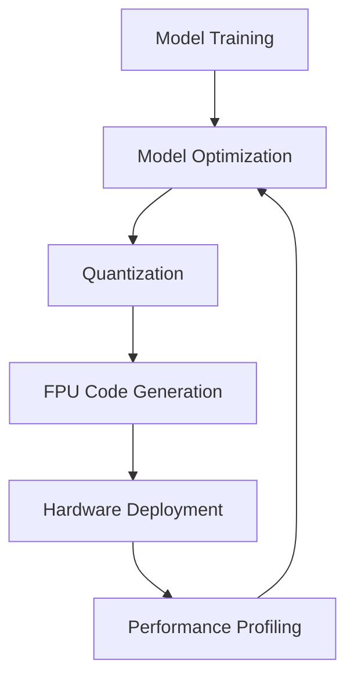

# The FPU Revolution: AI-Powered Microcontrollers

Modern Floating Point Units (FPU) have evolved from basic arithmetic processors to sophisticated AI acceleration engines. Today's microcontrollers integrate advanced FPU capabilities that enable complex machine learning algorithms to run efficiently at the edge, transforming embedded systems into intelligent devices.

## Modern FPU Technical Capabilities

### High-Performance Computing

Current ARM Cortex-M7 FPU delivers exceptional performance:
```c
// Performance benchmarks (180 MHz Cortex-M7)
float add_operation = a + b;        // 1 cycle
float multiply = a * b;             // 1 cycle  
float fma = a * b + c;              // 1 cycle (fused multiply-add)
float divide = a / b;               // 14 cycles
float sqrt_val = sqrtf(a);          // 14 cycles
```

### Double-Precision Evolution

Recent microcontrollers now include double-precision FPUs:
```c
// Cortex-M7 with DP-FPU
double precise_calc = sin(3.14159265358979323846);
// Hardware acceleration for 64-bit floating point
```

### Vector Operations

Modern FPUs support SIMD (Single Instruction, Multiple Data):
```c
// ARM Helium (M-Profile Vector Extension)
float32x4_t vector_a = {1.0f, 2.0f, 3.0f, 4.0f};
float32x4_t vector_b = {5.0f, 6.0f, 7.0f, 8.0f};
float32x4_t result = vaddq_f32(vector_a, vector_b);
// Process 4 floating-point operations simultaneously
```

## The AI Integration Revolution

### Why FPU Matters for AI

Machine learning algorithms are fundamentally mathematical operations:

```python
# Neural network forward pass (conceptual)
def forward_pass(input_data, weights, bias):
    # Matrix multiplication (FPU intensive)
    output = np.dot(input_data, weights) + bias
    # Activation function (transcendental functions)
    return sigmoid(output)
```

**AI Computational Requirements:**
- **Matrix operations**: Massive parallel multiplication/addition
- **Activation functions**: sigmoid, tanh, ReLU (FPU optimized)
- **Convolutions**: Sliding window operations
- **Backpropagation**: Gradient calculations

### Traditional vs AI-Optimized FPU

| Traditional FPU | AI-Optimized FPU |
|----------------|------------------|
| Single precision (32-bit) | Mixed precision (16/32-bit) |
| Sequential operations | Vector/SIMD operations |
| IEEE 754 strict compliance | flexible precision for speed |
| General-purpose instructions | AI-specific instructions |

### Neural Processing Units (NPU) Integration

Modern SoCs combine traditional FPU with dedicated AI accelerators:

```c
// STM32MP25 with NPU integration
void ai_inference_example() {
    // Traditional FPU for control logic
    float sensor_reading = adc_value * calibration_factor;
    
    // NPU for neural network inference
    ai_network_run(input_buffer, output_buffer);
    
    // FPU for post-processing
    float confidence = output_buffer[0] * confidence_scale;
}
```

## Modern AI-Enabled Microcontrollers

### ARM Cortex-M55 with Ethos-U55

The Cortex-M55 represents the convergence of traditional MCU and AI capabilities:

**Features:**
- **Helium Vector Extensions**: 128-bit SIMD operations
- **Enhanced FPU**: Mixed-precision floating point
- **AI Instructions**: Dedicated ML acceleration
- **Low Power**: AI inference at µW levels

```c
// Cortex-M55 AI inference example
#include "arm_math.h"
#include "arm_nnfunctions.h"

void neural_network_inference() {
    // Input preprocessing with enhanced FPU
    arm_float_to_q15(input_float, input_q15, INPUT_SIZE);
    
    // Neural network layers with AI acceleration
    arm_fully_connected_q15(input_q15, weights, bias, output);
    
    // Activation with vector operations
    arm_relu_q15(output, OUTPUT_SIZE);
}
```

### STM32 AI Ecosystem

STMicroelectronics' comprehensive AI solution:

**X-CUBE-AI**:
- Automatic neural network optimization
- Quantization for efficient FPU usage
- Deployment tools for various STM32 families

```c
// Auto-generated AI code
#include "ai_platform.h"
#include "network.h"

void stm32_ai_inference() {
    ai_handle network_handle = AI_HANDLE_NULL;
    
    // Initialize AI network
    ai_network_create(&network_handle, AI_NETWORK_DATA_CONFIG);
    
    // Run inference using optimized FPU operations
    ai_network_run(network_handle, input_buffer, output_buffer);
}
```

### ESP32-S3 AI Acceleration

Espressif's approach to AI integration:

```c
// ESP-NN optimized operations
#include "esp_nn.h"

void esp32_ai_example() {
    // Optimized convolution using FPU + custom instructions
    esp_nn_conv2d_s8(input_data, kernel, bias, output_data,
                     input_dims, kernel_dims, output_dims,
                     conv_params);
}
```

## Quantization: The Bridge Between FPU and AI

### Mixed-Precision Computing

Modern AI applications use multiple numeric formats:

```c
// Quantization example
typedef struct {
    int8_t quantized_value;
    float scale;
    int8_t zero_point;
} quantized_param_t;

float dequantize(quantized_param_t q) {
    return q.scale * (q.quantized_value - q.zero_point);
}

int8_t quantize(float value, float scale, int8_t zero_point) {
    return (int8_t)(value / scale + zero_point);
}
```

**Benefits:**
- **Memory efficiency**: 4x reduction (32-bit → 8-bit)
- **Speed**: Integer operations faster than FPU
- **Power**: Lower energy per operation

### FPU Role in Quantized Networks

Even with quantization, FPU remains crucial:

```c
void quantized_inference_with_fpu() {
    // Input normalization (FPU)
    float normalized_input[INPUT_SIZE];
    for(int i = 0; i < INPUT_SIZE; i++) {
        normalized_input[i] = (raw_input[i] - mean) / std_dev;
    }
    
    // Quantization (FPU → Integer)
    int8_t quantized_input[INPUT_SIZE];
    quantize_array(normalized_input, quantized_input, INPUT_SIZE);
    
    // Integer inference (NPU/optimized integer ops)
    int8_t quantized_output[OUTPUT_SIZE];
    run_quantized_network(quantized_input, quantized_output);
    
    // Dequantization and post-processing (FPU)
    float final_output[OUTPUT_SIZE];
    dequantize_array(quantized_output, final_output, OUTPUT_SIZE);
}
```

## Development Tools and Ecosystem

### AI Development Workflow



### Profiling FPU Performance

```c
// FPU performance monitoring
void profile_fpu_usage() {
    enable_cycle_counter();
    uint32_t start_cycles = get_cycle_count();
    
    // AI inference
    run_neural_network();
    
    uint32_t end_cycles = get_cycle_count();
    uint32_t fpu_cycles = end_cycles - start_cycles;
    
    float fpu_utilization = (float)fpu_cycles / TOTAL_CYCLES;
    log_performance_metrics(fpu_utilization);
}
```
